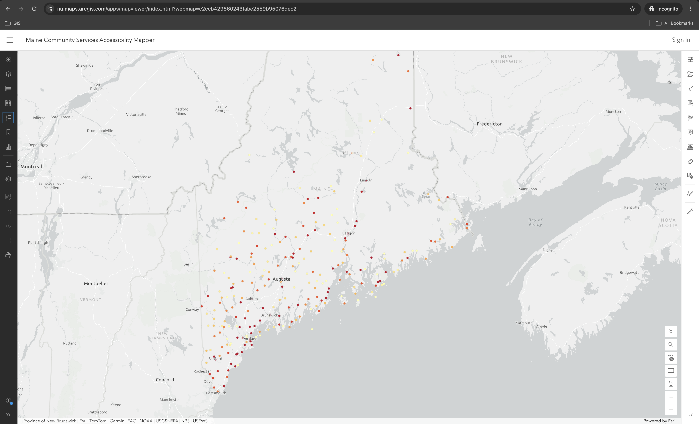
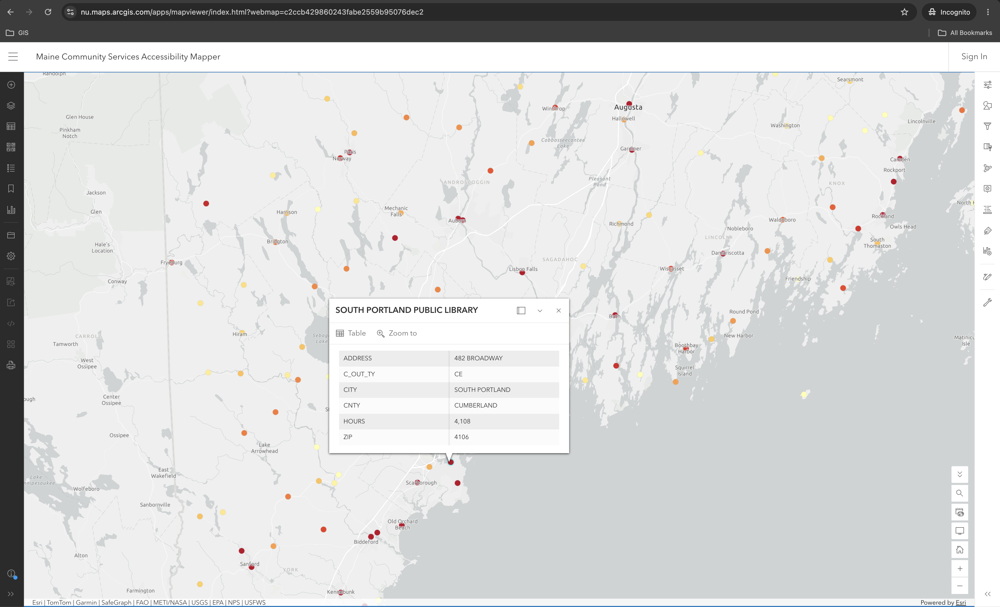
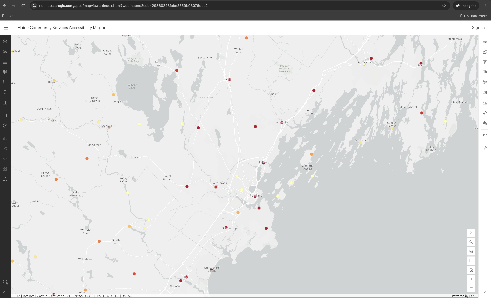

# Maine Community Services Accessibility Mapper

An ArcGIS Online web map and ArcGIS Experience Builder application visualizing public library accessibility across Maine, built as a portfolio project.

This project demonstrates the complete GIS workflow, from data acquisition and cleaning to hosted feature layers, web mapping, and an interactive ArcGIS Experience Builder application.

**Live Application (Phase 2):** [View Experience Builder App](https://experience.arcgis.com/experience/0fe080c014fd44dd80ca0bd9f9a4d706)
**Web Map (Phase 1):** [View on ArcGIS Online](https://nu.maps.arcgis.com/apps/mapviewer/index.html?webmap=c2ccb429860243fabe2559b95076dec2)

---

## Project Overview

Maine is the most rural state in the contiguous US, and access to public services varies significantly across the state. This project maps all 264 public library outlet locations in Maine, symbolized by annual hours of operation — a proxy for how accessible each library is to its community.

The darker the point, the more hours that library is open per year. The lightest points represent libraries open fewer than 633 hours annually.

---

## Objectives

- Practice the full GIS data workflow: acquire → clean → publish → visualize
- Publish a properly structured Hosted Feature Layer in ArcGIS Online
- Build a professional web map with meaningful symbology and popups
- Build an interactive Experience Builder application with search and filters
- Document every design decision so I can explain it in an interview

---

## Data Source

**Institute of Museum and Library Services (IMLS)**
Public Libraries Survey — Fiscal Year 2023
[imls.gov](https://www.imls.gov/research-evaluation/surveys/public-libraries-survey-pls)

I used the outlet-level file (`pls_fy23_outlet_pud23i.csv`) rather than the administrative entity file because it contains one record per physical library location — which is what I needed for accurate point mapping. The dataset included pre-geocoded latitude and longitude coordinates, so no geocoding was required.

After filtering to Maine only, the dataset contained 264 library outlet locations.

---

## Tools Used

- ArcGIS Online — hosted feature layer, web map, symbology, popups
- ArcGIS Experience Builder — interactive application with search and filters
- Google Sheets — data filtering and cleaning
- IMLS Public Libraries Survey — data source

---

## Workflow

1. Downloaded the IMLS FY2023 Public Libraries Survey (outlet file)
2. Filtered to Maine (`STABR = ME`) — 264 records
3. Removed irrelevant columns, keeping: library name, address, city, ZIP, county, outlet type, hours, latitude, longitude
4. Published as a Hosted Feature Layer in ArcGIS Online using latitude/longitude coordinates (no geocoding credits used). Data published using WGS 1984 Web Mercator (WKID 3857), AGOL's default display CRS.
5. Created a web map with graduated color symbology based on `HOURS` field
6. Configured popups to display library name, address, city, county, outlet type, and annual hours
7. Set basemap to Light Gray Canvas for visual clarity
8. Built an Experience Builder application with search, legend, and interactive filters

---

## Symbology Decisions

I chose graduated color (yellow → dark red) based on the `HOURS` field because the project is about accessibility — a library open 2,500 hours per year is meaningfully more accessible than one open 200 hours. Color encodes that difference immediately and intuitively.

I deliberately chose not to use outlet type (CE/BR/BS) as the primary symbology because hours more directly answers the accessibility question this map is trying to address.

---

## Pop-up Configuration

Each popup shows:

- Library name (as the popup title)
- Street address
- City
- County
- Outlet type (CE = Central, BR = Branch, BS = Bookmobile)
- Annual hours open

I removed latitude, longitude, and state abbreviation from the popup because they don't add value for a map user.

---

## Experience Builder Application (Phase 2)

The Experience Builder app adds interactivity on top of the web map:

- **Search** — find addresses or places on the map
- **Filter by County** — filter libraries by Maine county
- **Filter by Outlet Type** — filter by outlet type (CE = Central, BR = Branch, BS = Bookmobile)
- **Filter by Annual Hours** — filter to libraries open at least a specified number of hours
- **Legend** — shows the graduated color scale
- **Scale bar** — standard cartographic element showing real-world distance

---

## Known Issues

- ZIP codes are missing their leading zero (e.g., `4101` instead of `04101`). This is a data formatting issue from the CSV export and does not affect map functionality.
- A small number of records have `HOURS = -1`, indicating the value was suppressed in the IMLS public-use file to protect confidentiality. These points appear at the low end of the color scale.

---

## Screenshots

**Full Maine View**

**Popup Example — South Portland Public Library**

**Southern Maine Density**

---

## Skills Demonstrated

- ArcGIS Online
- ArcGIS Experience Builder
- Hosted Feature Layers
- Data Cleaning
- Spatial Data Visualization
- Graduated Symbology
- Pop-up Configuration
- Interactive Filters (SQL Expressions)
- Cartographic Design
- GitHub Documentation

---

## Current Status

Phase 1 (Web Map MVP) — **Complete**
Phase 2 (ArcGIS Experience Builder Application) — **Complete**

